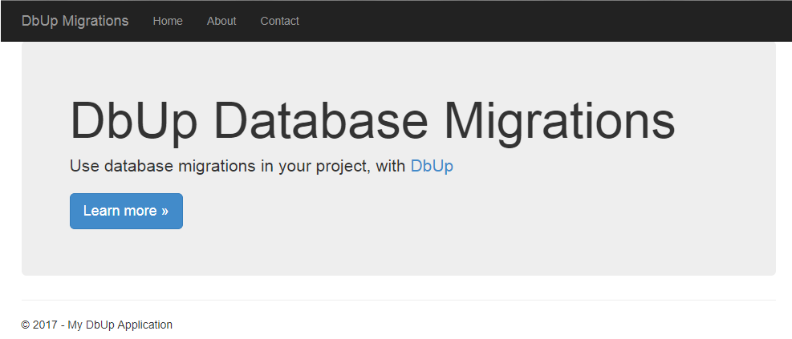

# Using DbUp for database migrations

This is a sample application demonstrating the use of [DbUp](https://dbup.github.io/) to perform database migrations on a MS SQL Server backed ASP.NET WebAPI application.

[Learn more](https://www.counihan.co.za/blog/Database-Migrations-with-DbUp/)